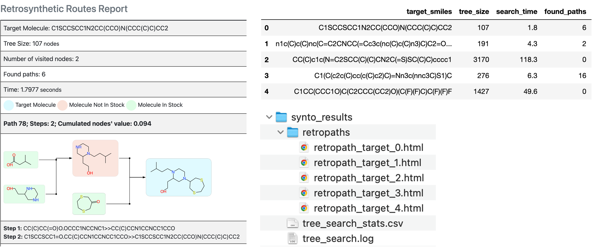

Planning
===========================

**Data**

The following data files are required for retrosynthesis planning with Synto:

`reaction_rules.pickle` - extracted with Synto reaction rules stored as CGRtools objects

`building_blocks.txt` - building blocks in SMILES format (.smi or .txt)

`policy_network.ckpt` - pre-trained policy network (expansion function)

`value_network.ckpt` - pre-trained value network (evaluation function)

**Configuration**

Retrosynthesis planning is configured with the `config_planning.yaml` configuration file:

.. code-block:: yaml

    General:
      reaction_rules_path: synto_planning_data/reaction_rules.pickle
      building_blocks_path: synto_planning_data/building_blocks.txt
    PolicyNetwork:
      weights_path: synto_planning_data/policy_network.ckpt
    ValueNetwork:
      weights_path: synto_planning_data/value_network.ckpt
    Tree:
      max_depth: 9  # maximum depth of tree
      max_iterations: 100  # maximum number of iterations
      max_time: 600  # search time limit
      verbose: True  # tree search progress bar

**Run planning**

For running retrosynthesis planning one needs three commands: (i) download reaction rules and pre-trained neural networks
(ii) prepare building blocks (canonicalize, standardize), the default building blocks are already preprocessed (iii) run
retrosynthesis planning:

.. code-block:: bash

    synto_planning_data
    synto_building_blocks --input="synto_planning_data/building_blocks.txt" --output="synto_planning_data/building_blocks.txt" # skip for loaded data
    synto_planning --targets="targets.txt" --config="planning_config.yaml" --results_root="synto_results"

**Planning results**

All retrosynthesis planning results are stored in the `synto_results` folder.
Found retrosynthesis pathways stored in HTML format and can be visually inspected:

